# F5 BIG-IP Advanced WAF - Brute Force Protection

A practical reference for configuring and understanding brute force protection on F5 BIG-IP Advanced WAF (AWAF / ASM).

> **Scope:** This repository uses F5 BIG-IP ASM 14.1 documentation and F5 article K18650749 as references. Exact menu names, defaults, and mitigation options can vary by BIG-IP release.

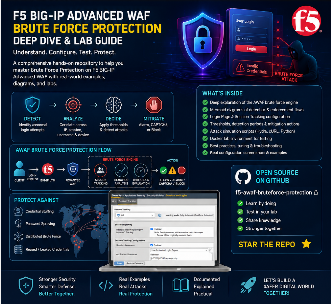
## What is brute force protection?

A brute force attack attempts to discover valid application credentials by repeatedly submitting username/password combinations. AWAF protects configured application login URLs by tracking failed login activity and evaluating the rate and number of failed attempts.

F5 documents two broad detection models:

- **Source-based brute force protection** — activity associated with a username, Device ID, or source IP.
- **Distributed brute force protection** — failed authentication activity accumulated across multiple sources.

AWAF can also identify credential-stuffing activity when the relevant capability is available and configured.

## Why the Login Page matters

Brute force protection needs to know which application request represents authentication. At least one Login Page must therefore be defined in the security policy.

A Login Page identifies the login URL and, depending on the authentication mechanism, the username/password fields and successful-login validation criteria.

Example:

```text
POST /my.policy
Username: username
Password: password
Successful login condition: Expected Response Status Code = 302
```

AWAF can learn login pages automatically from traffic, or an administrator can create them manually. Login pages can also be used by login enforcement and session awareness.

## Enforcement mode

Brute force mitigation requires the security policy to operate in **Blocking** enforcement mode. In Transparent mode, brute force mitigation actions are not performed.

For automatic policy building, F5 documents enabling the brute-force violation for Alarm and Block where appropriate.

## How AWAF evaluates a login attempt

1. The client sends a request to the BIG-IP virtual server.
2. AWAF evaluates the request against the security policy.
3. If it matches a configured Login Page, AWAF can associate the authentication attempt with the configured login identity.
4. The application response is evaluated against the Login Page success criteria.
5. Failed authentication activity contributes to the applicable tracking/correlation counters.
6. AWAF evaluates configured detection periods and thresholds.
7. If a threshold is reached, the configured mitigation action is applied.

### Mermaid - Detection Flow

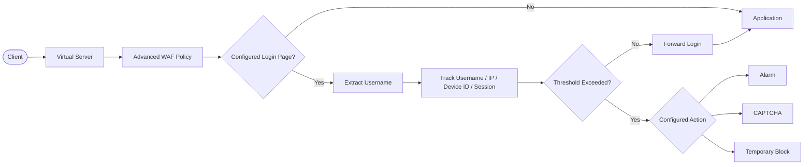

### Mermaid - Request Processing Pipeline

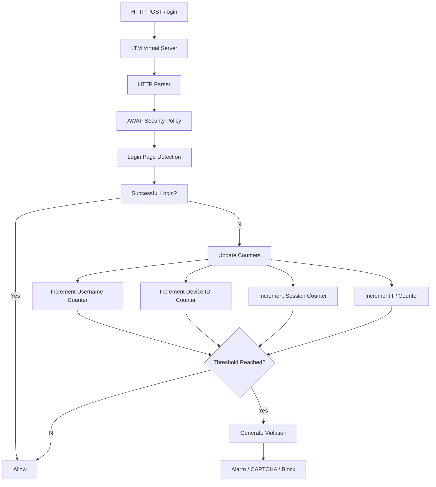

### Mermaid - Session Tracking

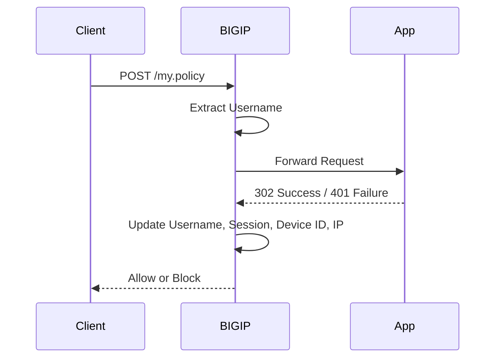

### Mermaid - Decision Tree

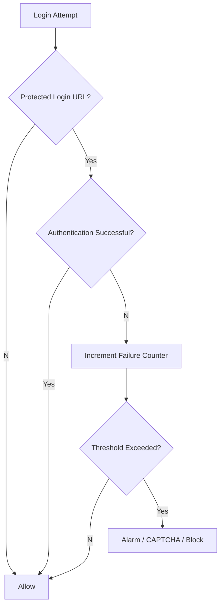

## Source-based protection

Source-based protection can track failed authentication activity using multiple dimensions.

### Username
Username tracking helps identify repeated failed attempts against a particular account, including attacks that rotate source IP addresses.

### Device ID
Device ID provides a tracking dimension beyond source IP. F5 notes that Device ID tracking requires the appropriate Device-ID mode and client-side JavaScript support.

### IP address
IP-based tracking identifies repeated failed login activity from a source address.

> **NAT consideration:** An IP threshold that is too low can affect legitimate users sharing a NAT address.

### Session
Session awareness associates authentication activity with an HTTP session. The supplied Session Tracking screenshot demonstrates username association and violation tracking configuration.

## Detection period and thresholds

A threshold should always be interpreted together with its detection period:

```text
Trigger = number of relevant failed-login violations
Window  = configured detection period
Action  = mitigation configured when the threshold is reached
```

The values shown in the supplied screenshots are examples from the user's AWAF configuration and are not universal F5 defaults.

## Distributed brute force

A distributed attack can keep each individual source below its local threshold. AWAF can correlate failed-login activity across multiple sources and detect a distributed attack when its configured threshold is reached.

### Mermaid - Distributed Attack

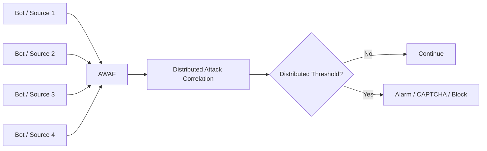

## Multiple mitigation signals

F5 documents that when source-based and distributed protections trigger simultaneously, the most severe configured mitigation action is used.

Example:

```text
Distributed attack  -> Alarm + CAPTCHA
Device ID threshold -> Alarm + Blocking Page
Effective action    -> Alarm + Blocking Page
```

## CAPTCHA and bypass protection

CAPTCHA can be used as a mitigation response rather than immediately blocking every suspicious authentication attempt.

Depending on the BIG-IP release/configuration, additional controls can address:

- Client-side integrity bypass
- CAPTCHA bypass
- Repeated failed logins after successful challenges

## Session hijacking and Device ID

The supplied Session Tracking configuration includes **Detect Session Hijacking by Device ID Tracking**.

The configuration associates session cookies with the Device ID that originally received them, creating an additional relationship between the session and client device.

The screenshot also shows:

- Session Awareness
- Application Username association
- Violation Detection Actions
- Username threshold
- Session threshold
- Device ID threshold
- IP Address threshold
- Blocked URL behavior
- Blocking duration

## Login enforcement

The supplied screenshots show a Login Page and a Login Enforcement section where authenticated URLs can be defined.

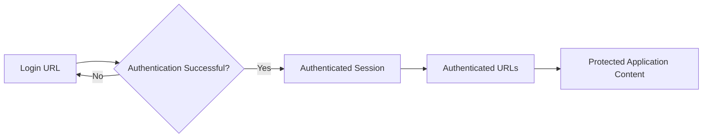

## Reporting and event logs

AWAF provides reporting and event-log views for brute force activity. These can show the application, targeted Login URL, attack start/end times, login attempts, security policy, and mitigation.

A single attack can generate many event records, so reporting is useful for understanding the overall attack.

## Recommended configuration workflow

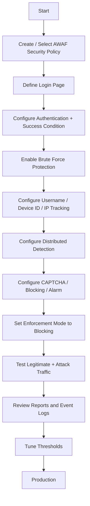

## Configuration screenshots

### 1. Session Tracking
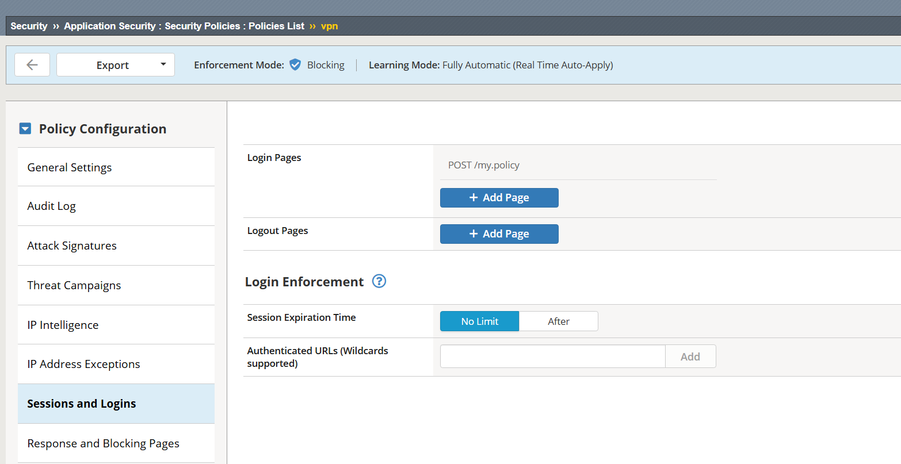

### 2. Sessions and Logins - Brute Force Violation
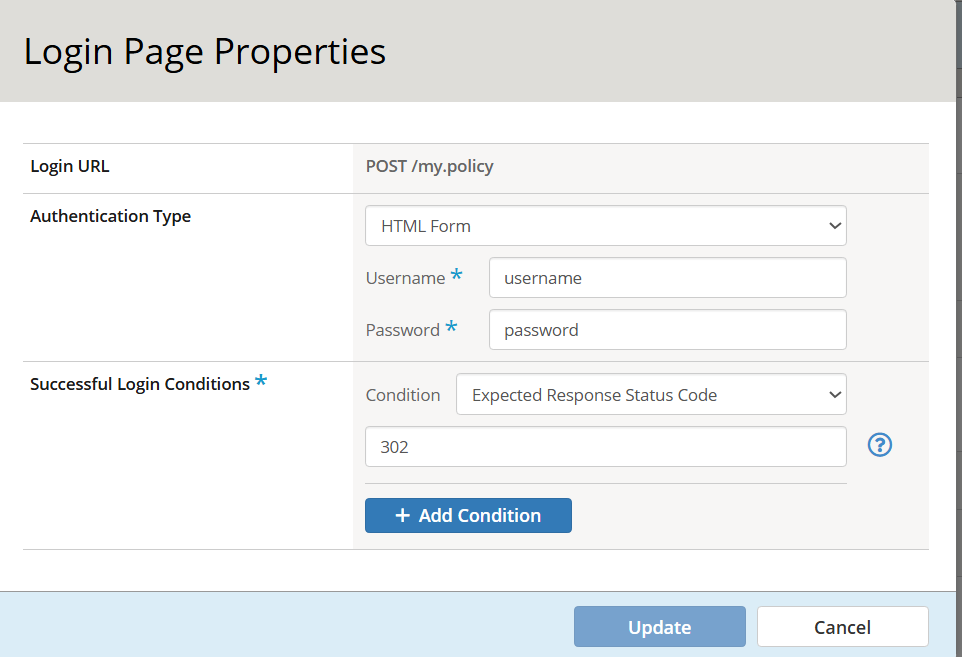

### 3. Security Policy - Learning and Blocking
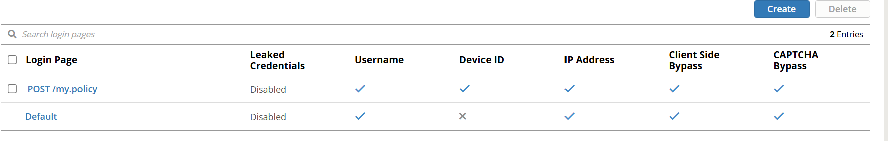

### 4. Login Pages
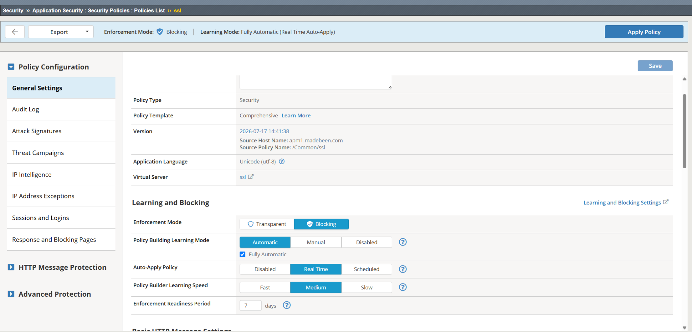

### 5. Login Page Properties
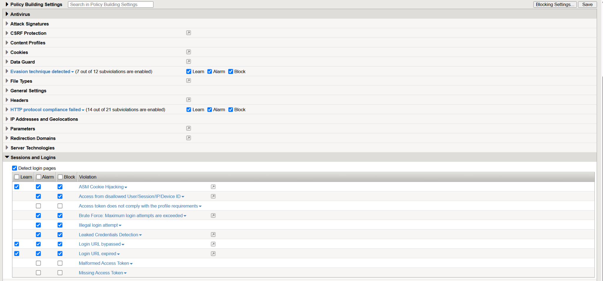

### 6. Login Enforcement
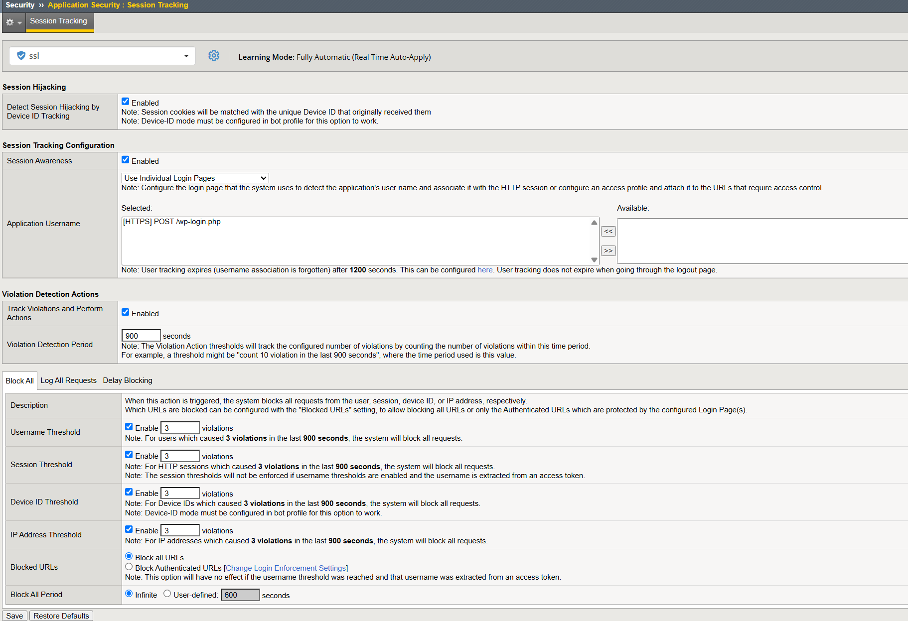

## Tuning guidance

- Protect the actual authentication endpoint.
- Correctly identify username/password parameters or JSON fields.
- Configure a reliable successful-login condition.
- Consider NAT environments before selecting aggressive IP thresholds.
- Use Device ID where appropriate.
- Test legitimate authentication failures before aggressive blocking.
- Review event logs and brute force reports after deployment.
- Configure response pages when required by the selected mitigation.
- Use custom per-login configurations when different login URLs genuinely require different thresholds.

## References

- F5 BIG-IP ASM 14.1 - Mitigating Brute Force Attacks:
  https://techdocs.f5.com/en-us/bigip-14-1-0/big-ip-asm-implementations-14-1-0/mitigating-brute-force-attacks.html
- F5 MyF5 - K18650749 - Configuring brute force attack protection (13.1.0 and later):
  https://my.f5.com/manage/s/article/K18650749

## Disclaimer

This repository is an educational configuration reference. Validate behavior against the exact BIG-IP/AWAF release deployed in your environment and current F5 documentation.
