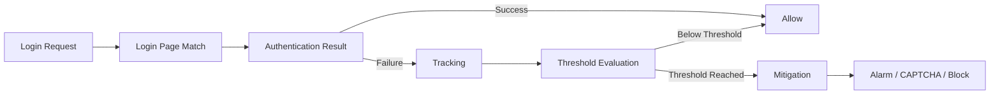

# F5 AWAF Brute Force Protection - Quick Reference

## Core prerequisites

1. BIG-IP Advanced WAF security policy.
2. At least one Login Page.
3. Reliable authentication-success condition.
4. Brute Force Protection enabled.
5. Blocking enforcement when mitigation is required.
6. Response pages configured when required by the selected mitigation.

## Detection dimensions

- Username
- Device ID
- Source IP
- HTTP Session
- Distributed attack correlation

## Quick flow

